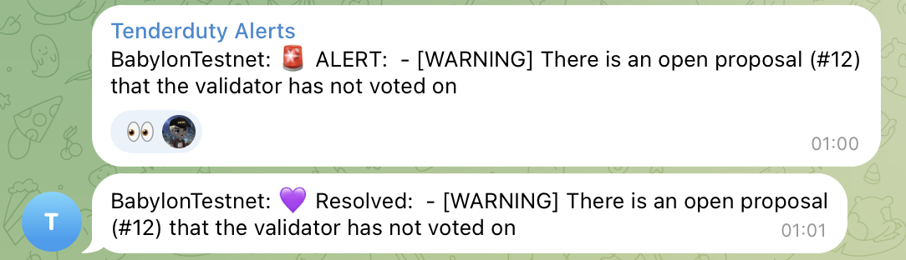

# 👉 Read this first!

This is a fork of the original [Tenderduty](https://github.com/blockpane/tenderduty) repository, which is no longer maintained by the author, and we have added the following features:

- **[Governance proposal monitoring.](#goverance-proposal-monitoring)**
  - Receive alerts when there are proposals in voting period and the validator has not voted on. The alert is resolved once the validator has voted.
  - Unvoted proposals are tracked and reported in the dashboard.
  - A Prometheus metric is also added to monitor the number of unvoted proposals.
- **[Improved support for Namada.](#support-for-namada)** Proper reporting of otherwise missing information such as the Moniker, uptime data or slashing threshold.
- **[Pre-built binaries.](#pre-built-binaries)** Releases now include pre-built binaries for Linux and MacOS.

We plan to keep maintaining and improving Tenderduty for our own use, and we encourage contributions to make it more useful.

We are documenting new features in more detail at the end of the original README, which starts below.

---

# TenderDuty v2

[](https://pkg.go.dev/github.com/firstset/tenderduty)
[](https://github.com/firstset/tenderduty/actions?query=workflow%3AGosec)
[](https://github.com/firstset/tenderduty/actions?query=workflow%3ACodeQL)

Tenderduty is a comprehensive monitoring tool for Tendermint chains. Its primary function is to alert a validator if they are missing blocks, and has many other features.

v2 is complete rewrite of the original tenderduty graciously sponsored by the [Osmosis Grants Program](https://grants.osmosis.zone/). This new version adds a web dashboard, prometheus exporter, telegram and discord notifications, multi-chain support, more granular alerting, and more types of alerts.


## Documentation

The [documentation](docs/README.md) is a work-in-progress.

## Runtime options

```
$ tenderduty -h
Usage of tenderduty:
  -example-config
     print the an example config.yml and exit
  -f string
     configuration file to use (default "config.yml")
  -state string
     file for storing state between restarts (default ".tenderduty-state.json")
  -cc string
     directory containing additional chain specific configurations (default "chains.d")
```

## Installing

Detailed installation info is in the [installation doc.](docs/install.md)

30 second quickstart if you already have Docker installed:

```
mkdir tenderduty && cd tenderduty
docker run --rm firstset/tenderduty:latest -example-config >config.yml
# edit config.yml and add chains, notification methods etc.
docker run -d --name tenderduty -p "8888:8888" -p "28686:28686" --restart unless-stopped -v $(pwd)/config.yml:/var/lib/tenderduty/config.yml firstset/tenderduty:latest
docker logs -f --tail 20 tenderduty
```

## Split Configuration

For validators with many chains, chain specific configuration may be split into additional files and placed into the directory "chains.d".

This directory can be changed with the -cc option

The user friendly chain label will be taken from the name of the file.

For example:

```
chains.d/Juno.yml -> Juno
chains.d/Lum Network.yml -> Lum Network
```

Configuration inside chains.d/Network.yml will be the YAML contents without the chain label.

For example start directly with:

```
chain_id: demo-1
    valoper_address: demovaloper...
```

## Contributions

Contributions are welcome, please open pull requests against the 'develop' branch, not main.

## New features

### Goverance Proposal Monitoring

When there are proposals in voting period and the validator has not voted on, an alert is sent to the configured channels.



### Support for Namada

For Namada, lots of information can be fetched via Namada indexers, instead of using ABCI queries. Thus we implement the provider pattern so that the queries can be dynamically adjusted based on the type of chains. The following configuration needs to be added for a Namada validator:

```yaml
chains:
  "Namada":
    # the following part is not required for other types of chains
    provider:
      name: namada
      configs:
        validator_address: tnam1....
        indexers:
          - https://index-namada.5elementsnodes.com
          - https://namada-indexer.denodes.xyz
          - https://namada-indexer.0xcryptovestor.com
```

### Per-chain Alert Severity Threshold for Different Channels

Thanks to the option `severity_threshold` in the config yaml, users are able to configure what kinds of alerts are sent to which channels. For example, if users want to receive only critical alerts on Pagerduty, but all alerts on Telegram, the following configuration can be used:

```yaml
# Global setting for pagerduty
pagerduty:
  severity_threshold: critical

# Telegram settings
telegram:
  severity_threshold: info
```

Here is a list of all the alerts on Tenderduty.

| AlertName                | AlertMessage                                                            | Severity                                    |
| ------------------------ | ----------------------------------------------------------------------- | ------------------------------------------- |
| ChainStalled             | stalled: have not seen a new block on chainX in Y minutes               | critical                                    |
| NoRPCEndpoints           | no RPC endpoints are working for chainX                                 | critical                                    |
| ValidatorInactive        | validator X is tombstoned for chainY                                    | critical                                    |
| ConsecutiveBlocksMissed  | validator has missed X blocks on chainY                                 | configured via `consecutive_priority`       |
| PercentageBlocksMissed   | validator has missed > X% of the slashing window's blocks on chainY     | configured via `percentage_priority`        |
| ConsecutiveEmptyBlocks   | validator has proposed X consecutive empty blocks on chainY             | configured via `consecutive_empty_priority` |
| PercentageEmptyBlocks    | validator has > X% empty blocks (Y of Z proposed blocks) on chainid ... | configured via `empty_percentage_priority`  |
| RPCNodeDown              | RPC node X has been down for > Y minutes on chainZ                      | configured via `node_down_alert_severity`   |
| UnvotedGoveranceProposal | There is an open proposal (#X) that the validator has not voted on      | warning                                     |

### Pre-built binaries

Releases now include pre-built binaries for Linux and MacOS and ARM64/AMD64, as well as a checksum file for verifying the integrity of the downloaded files.

### Run the latest version of this Tenderduty via Docker

Versions of this forked Tenderduty project are published on Docker Hub at `firstset/tenderduty`. For now, we always use the `latest` tag and later on will add semantic versioning for it.

```bash
# for the first time, touch a file for saving alert states
touch .tenderduty-state.json

# fetch an example-config and modify it
wget https://github.com/Firstset/tenderduty/blob/main/example-config.yml

# create the container, port 8888 is for the dashboard, and 28686 is for the prometheus metrics
docker run -d --name tenderduty -p "8888:8888" -p "28686:28686" --restart unless-stopped -v $(pwd)/config.yml:/var/lib/tenderduty/config.yml -v $(pwd)/.tenderduty-state.json:/var/lib/tenderduty/.tenderduty-state.json firstset/tenderduty:latest
```
